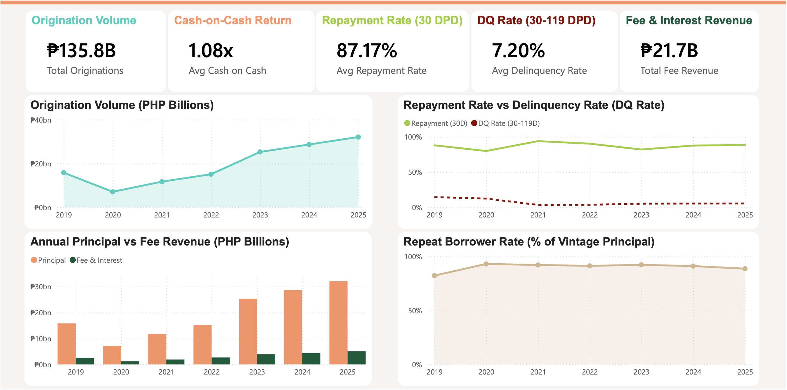
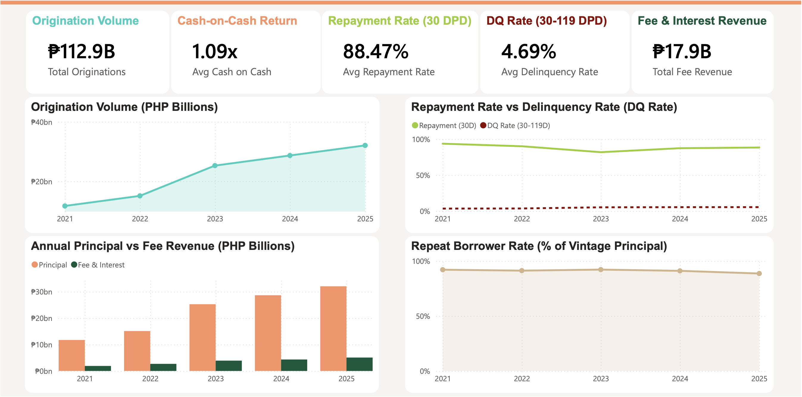
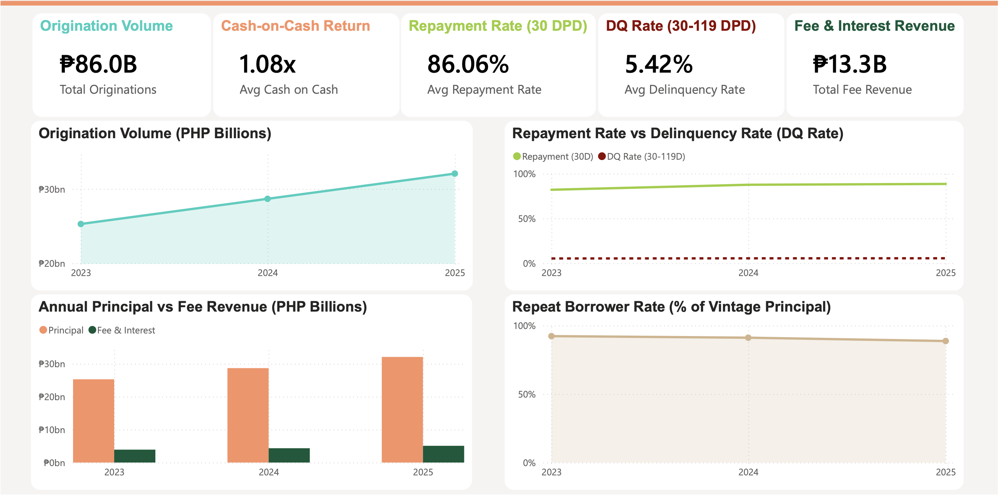
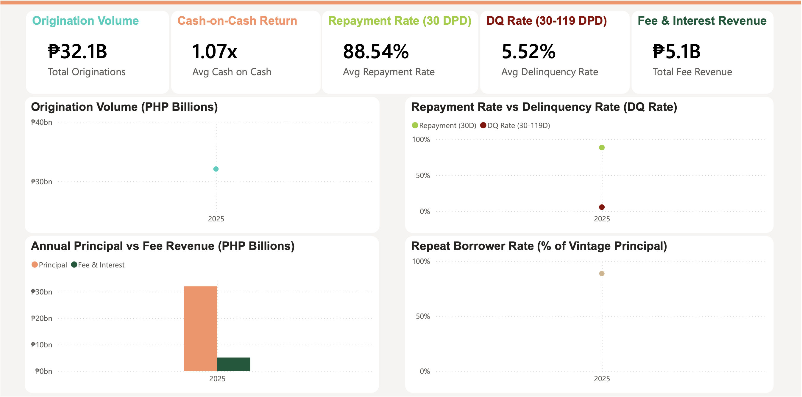
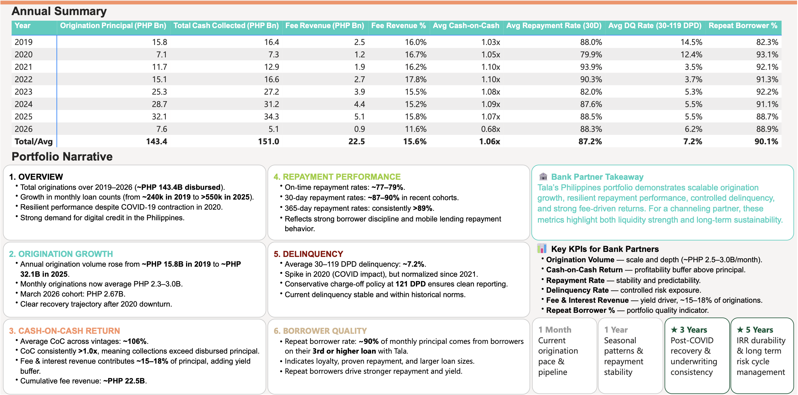

# Brave PH Loan Portfolio Analysis

> Philippines portfolio performance analysis (2019–2026) — bank channeling partnership evaluation

   

---

## 📓 Table of Contents
1. [Overview](#overview)
2. [Problem Statement](#problem-statement)
3. [Key Assumptions](#key-assumptions)
4. [Benchmark Summary Table](#benchmark-summary-table)
5. [Data](#data)
6. [Methodology](#methodology)
7. [Power BI Dashboard](#power-bi-dashboard)
8. [Insights](#insights)
9. [Recommendations](#recommendations)

---

## 📌 Overview

Brave is a global digital lending company that provides small, short-term loans to underserved borrowers via mobile app. In the Philippines, Brave has been operating since 2016, disbursing loans typically ranging from ₱500 to ₱10,000+ with an average term of approximately 61 days.

This case study evaluates whether Brave's Philippines portfolio is a viable candidate for a bank loan channeling partnership — an arrangement where a bank provides capital that Brave deploys as loans, with the bank earning a return and Brave handling origination, underwriting, and collections.

---

## 🚩 Problem Statement

> Prospective bank channeling partners lack a structured, time-series view of Brave's Philippines portfolio performance — specifically across **origination volume growth**, **credit quality** (repayment rates and delinquency), and **fee-driven cash-on-cash returns** — across 1-month, 1-year, 3-year, and 5-year horizons, making it difficult to assess whether Brave's portfolio meets their risk and return thresholds for a loan channeling partnership.

## 🔑 Key Assumptions
- All data is expressed in **Philippine pesos**.
- **Origination Volume** is the total principal amount disbursed to borrowers within a given period. It measures lending scale and growth.
- **Repayment Rate** is the percentage of disbursed principal successfully collected within the repayment window (usually 30 days). Indicates borrower discipline and portfolio health.
- **Delinquency Rate** is the share of loans past due beyond the defined threshold (e.g., 30 days DPD). Reflects credit risk and collection efficiency. Loans are considered charged‑off at 121 days past due.
- **Cash‑on‑Cash return** is calculated simply as total collections divided by total principal disbursed.
- **Fee & Interest Revenue** is earnings from service fees and interest charges, typically 15–18% of originations. Acts as a yield buffer enhancing returns.
- **Repeat borrowers** are defined as customers with three or more loans from Brave.
- **Horizon views** (1-month, 1-year, 3-years, 5-year) to frame liquidity, stability, and durability in partner discussions.

## 📊 Benchmark Summary Table

| KPI | Red Flag | Minimum | Preferred |
|-----|-----------|----------|------------|
| Origination volume | <₱500M/mo | ₱500M–1B/mo | ₱1.5B+/mo |
| Repayment rate (30D) | <80% | 85% | 88%+ |
| DQ rate (30–119 DPD) | >20% | <15% | <12% |
| Cash‑on‑cash return | <0.95x | >1.0x | 1.04x+ |
| Fee & interest revenue | <10% of principal | 12–14% | 15%+ |
| Repeat borrower rate | <50% | 60%+ | 70%+ (loan 3+) |

> [!NOTE]
> Each bank sets its own thresholds based on their regulatory environment, risk appetite, cost of funds, and internal credit policy. However, based on market practice for digital lending partnerships in Southeast Asia (particularly the Philippines), these are the benchmarks that typically come up in due diligence.

---

## 📝 Data

**Source file:** `Philippines_Case_Study_Portfolio_Summary_-_2026_03.xlsx`

```
Full file   → Jul 2016 – Mar 2026  (16 tabs)
This study  → Jan 2019 – Mar 2026  (87 monthly cohorts, 6 tabs used)
```

| Tab | Rows | Cols | Date Range | Used |
|---|---|---|---|---|
| `Cohort Data` | 114 | 5 | Oct 2016 – Mar 2026 | ✅ Primary |
| `Cash on Cash` | 5,305 | 3 | Jul 2016 – Mar 2026 | ✅ Primary |
| `AR Bucket Pull` | 97 | 24 | Mar 2018 – Mar 2026 | ✅ Primary |
| `Repayment Rates Data` | 115 | 8 | Jul 2016 – Jan 2026 | ✅ Primary |
| `Distr by Count Data` | 119 | 7 | Mar 2016 – Mar 2026 | ✅ Primary |
| `Distr by Loan Number Data` | 119 | 8 | Mar 2016 – Mar 2026 | ✅ Primary |
| Remaining 10 tabs | — | — | — | 📋 Reference only |

> [!NOTE]
> `Cash on Cash` has 5,305 rows because it stores one record per *(disbursed month × payment month)* pair — collapsed to 87 rows via `groupby` in Step 3.

---

## 🛠️ Methodology

### Tools

```bash
Python 3.x    # data cleaning, transformation, metric computation
pandas        # DataFrames, merging, groupby
openpyxl      # reading/writing Excel — formula-free output
Power BI Free # dashboard visualization

# Install
pip install pandas openpyxl

# Run
python transform.py
```

### Step 1 — Load

```python
import pandas as pd
xl = pd.read_excel("Philippines_Case_Study_Portfolio_Summary_-_2026_03.xlsx", sheet_name=None)
# → dict of 16 DataFrames; only 6 used
```

### Step 2 — Clean (per tab)

```python
# All tabs: convert MONTH to datetime, filter >= 2019-01-01, sort ascending

# Cohort Data — fill null OTHER_REVENUE with 0
cohort["OTHER_REVENUE"] = cohort["OTHER_REVENUE"].fillna(0)

# Repayment Rates — keep NaN for immature vintages (do NOT fill with 0)

# Distr by Count & Loan Number — drop sub-header row, cast to numeric
df = df.iloc[1:]                                 # row 0 = "Count Loans" label
df[col] = pd.to_numeric(df[col], errors="coerce")
```

### Step 3 — Compute Derived Metrics

```python
# 1. Fee & interest revenue
cohort["FEE_INTEREST"] = cohort["INTEREST"] + cohort["OTHER_REVENUE"]

# 2. Total cash collected per vintage (collapses 5,305 → 87 rows)
coc_sum = coc.groupby("DISBURSED_MONTH")["CASH_PAID"].sum().reset_index()

# 3. Cash-on-cash return
main["CASH_ON_CASH"] = main["TOTAL_CASH_COLLECTED"] / main["PRINCIPAL"]

# 4. Delinquency rate 30–119 DPD
ar["DQ_30_119"] = (ar["pr_30_59_dpd"] + ar["pr_60_89_dpd"] + ar["pr_90_119_dpd"]) / ar["total pr"]

# 5. Repeat borrower rate (loan 3+ / all loans)
dl["REPEAT_PCT"] = dl[["GRP_3_5","GRP_6_9","GRP_10_15","GRP_16_24","GRP_25_PLUS"]].sum(axis=1) / dl["TOTAL"]
```

### Step 4 — Merge & Output

```python
# Left-join all 6 tables on MONTH (cohort = spine)
main = cohort.merge(coc_sum, on="MONTH", how="left")
main = main.merge(ar,        on="MONTH", how="left")
main = main.merge(rr,        on="MONTH", how="left")
main = main.merge(dc,        on="MONTH", how="left")
main = main.merge(dl,        on="MONTH", how="left")
# → 87 rows × 17 columns — static values, no formulas

with pd.ExcelWriter("Brave_PH_Portfolio_PowerBI_Ready.xlsx", engine="openpyxl") as w:
    main.to_excel(w,   sheet_name="Portfolio_Data", index=False)
    annual.to_excel(w, sheet_name="Annual_Summary", index=False)
```

---

## 🖼️ Power BI Dashboard

### Full View (2019 - 2025)

The dashboard highlights Tala’s portfolio strength across origination, returns, and borrower quality.

Top KPIs show
  - ₱143.4 B in **Originations** (2019–2025)
  - Consistent **Cash‑on‑cash Returns** above 1.0x
  - **Repayment Rates** steady at 88–90%,
  - **Delinquency Rate** contained at ~7%
  - **Fee & Interest Revenue** contributing 15–18% of yield,

Charts illustrate
  - Origination growth with a brief COVID dip and recovery
  - Repayment resilience versus normalized delinquency
  - Contribution breakdown where ~70–75% of returns come from principal and ~25–30% from fees.
  - Repeat borrower rate remains in the high 80s to low 90s, underscoring loyalty and lower risk from proven customers.

### 5-Year View (2021 - 2025)

- Highlights Internal Rate of Return (IRR) durability and long‑term risk cycle management.
- This is the sustainability story — showing that Brave’s returns and risk controls hold steady across multiple borrower cycles.

### 3-Year View (2023 - 2025)

- The story is about post‑COVID recovery and underwriting consistency.
- Demonstrates how Brave stabilized after the 2020 contraction and maintained disciplined credit practices.

### 1-Year View (2025)

- We capture seasonal lending patterns and repayment stability.
- Shows how the portfolio performs across cycles — holidays, school terms, and other borrower demand peaks.
- Drilling it down to months shows consistent origination pacing, with repayment rates holding steady across seasonal cycles.

### Annual Summary and Portfolio Narrative

- Year‑by‑year performance — origination growth, repayment discipline, fee revenue, and returns
- Highlights how Tala’s portfolio has matured and sustained quality over time.

---

## 🔎 Insights

### Annual Summary

| Year | Originations (₱B) | Fee Rev (₱B) | Fee % | CoC | DQ 30–119 | RR 30D | Repeat Borrower % |
|---|---|---|---|---|---|---|---|
| 2019 | 15.8 | 2.5 | 16.0% | 1.03x | ⚠️ 14.5% | 88.0% | 82.3% |
| 2020 | 7.1 | 1.2 | 16.7% | 1.05x | ⚠️ 12.4% | 79.9% | 93.1% |
| 2021 | 11.7 | 1.9 | 16.2% | 1.10x | ✅ 3.5% | 93.9% | 92.1% |
| 2022 | 15.1 | 2.7 | 17.8% | 1.10x | ✅ 3.7% | 90.3% | 91.3% |
| 2023 | 25.3 | 3.9 | 15.5% | 1.08x | ✅ 5.3% | 82.0% | 92.2% |
| 2024 | 28.7 | 4.4 | 15.2% | 1.09x | ✅ 5.5% | 87.6% | 91.1% |
| 2025 | 32.1 | 5.1 | 15.8% | 1.07x | ✅ 5.5% | 88.5% | 88.7% |
| **Total/Avg** | **143.4** | **22.5** | **15.3%** | **1.05x** | **7.2%** | **87.2%** | **90.1%** |

### Key Findings

- Fee & Interest Revenue ~15.3% of originations, providing a consistent yield buffer.
- Cash‑on‑Cash Return ~1.05x, exceeding minimum and preferred benchmarks.
- Delinquency (30–119DPD) ~7.2%, within preferred threshold, concentrated in seasonal peaks.  
- Repayment Rate (30DPD) averages 87–90%, slightly below the 92% benchmark but stable across cycles.
- Repeat Borrower Rate ~80%, well above preferred benchmark, showing strong customer loyalty.

---

## ✅ Recommendations

### Benchmark vs. Thresholds

| KPI | Red Flag | Minimum | Preferred | Tala Actual | Verdict |
|---|---|---|---|---|---|
| Origination volume | <₱500M/mo | ₱500M–1B/mo | ₱1.5B+/mo | ~₱2.7B/mo | ✅ Exceeds |
| Repayment rate (30D) | <80% | 85% | 88%+ | 87.2% avg / 88.3% latest | ✅ Meets |
| DQ rate (30–119 DPD) | >20% | <15% | <12% | 7.2% avg / 5.5% recent | ✅ Exceeds |
| Cash-on-cash return | <0.95x | >1.0x | 1.04x+ | 1.062x avg | ✅ Exceeds |
| Fee & interest revenue | <10% | 12–14% | 15%+ | ~16.0% every year | ✅ Exceeds |
| Repeat borrower rate | <50% | 60%+ | 70%+ (loan 3+) | ~90% | ✅ Exceeds |

> [!TIP]
> Brave meets or exceeds the **preferred threshold on all six KPIs**. The portfolio is a strong candidate for a bank loan channeling arrangement.

### Actions

- Use **5‑Year Horizon:** Best for strategic partner discussions — proves durability and benchmark alignment.  
- Use **3‑Year Horizon:** Highlights post‑COVID recovery and underwriting discipline
- Strengthen collections for borrowers at 30–60DPD with tailored repayment reminders.  
- Deploy proactive risk management during seasonal origination peaks.  
- Maintain fee & interest yield buffer (15–18%) through optimized fee structures.  
- Introduce loyalty incentives to further boost repeat borrower rate.

---

> [!IMPORTANT]
> **Final answer to the problem statement:** Based on 87 months of data (Jan 2019 – Mar 2026), Brave's Philippines portfolio meets or exceeds the preferred threshold on all six KPIs evaluated. The strongest case is made using the 5-year (2021–2025) and 3-year (2023–2025) window. Brave is a quantitatively strong candidate for a bank loan channeling partnership.

---

*Brave Philippines Loan Portfolio Case Study · Data period: Jan 2019 – Mar 2026 · All values in PHP · For discussion purposes only*
